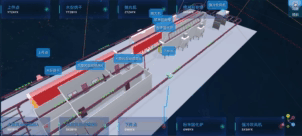

<!--
 * @Author: zhou lei
 * @Date: 2024-01-29 10:38:55
 * @LastEditTime: 2024-03-27 17:37:21
 * @LastEditors: zhoulei && 910592680@qq.com
 * @Description: Description
 * @FilePath: /vue3_ts_three/README.md
 *  
-->
# vue3_ts_three

本项目是使用vue3 + typescript + three.js 搭建的

## 项目结构


- App.ts 是初始化类
- views/home
  - HomeView.vue 示例主页
  - components 存放子组件
- use 是对应的views/下的主页存放通用逻辑,实际都封装到App.ts中了
- components
  - helpers 存放了threejs的基础方法
  - effect 后期效果-outline
  - models 模型动画材质加载的通用方法
  - config 通用配置文件，可开启GUI辅助

## 已经完成的功能

- 通用模型加载进度
- 动画播放控制
- 模型材质控制
- effect-outline
- html与场景交互链线
- 镜头动画
- 报警显示
- 分层场景切换（风机与工厂）
- css2d标签
- json-server测试接口服务

## 效果预览

### 预览


### 通用模型加载进度


### effect-outline


### html与场景交互链线


### 镜头动画



### 分层场景切换（风机与工厂）
<!-- 并控制大小为500px-->


## 安装依赖

```sh
npm install
```

### Compile and Hot-Reload for Development

```sh
npm run dev
```

## 开发说明

App.ts为程序入口，以实例化后的app拆封功能并为各个组件提供服务

## 参考项目

VBen项目中对axios的封装
